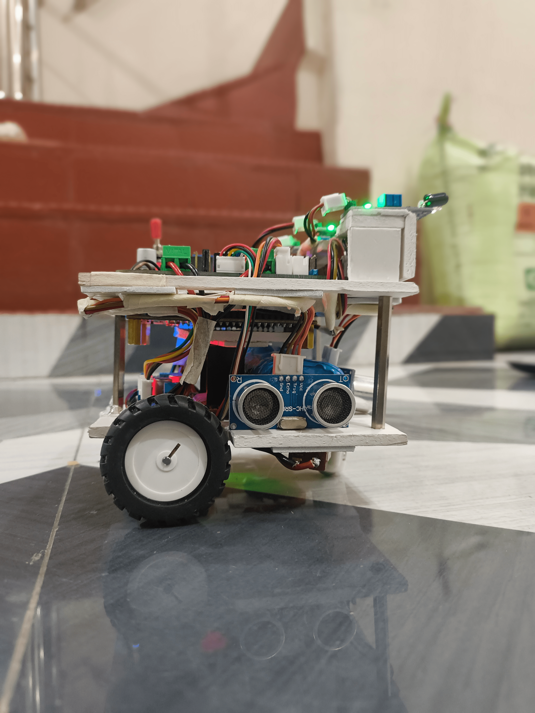
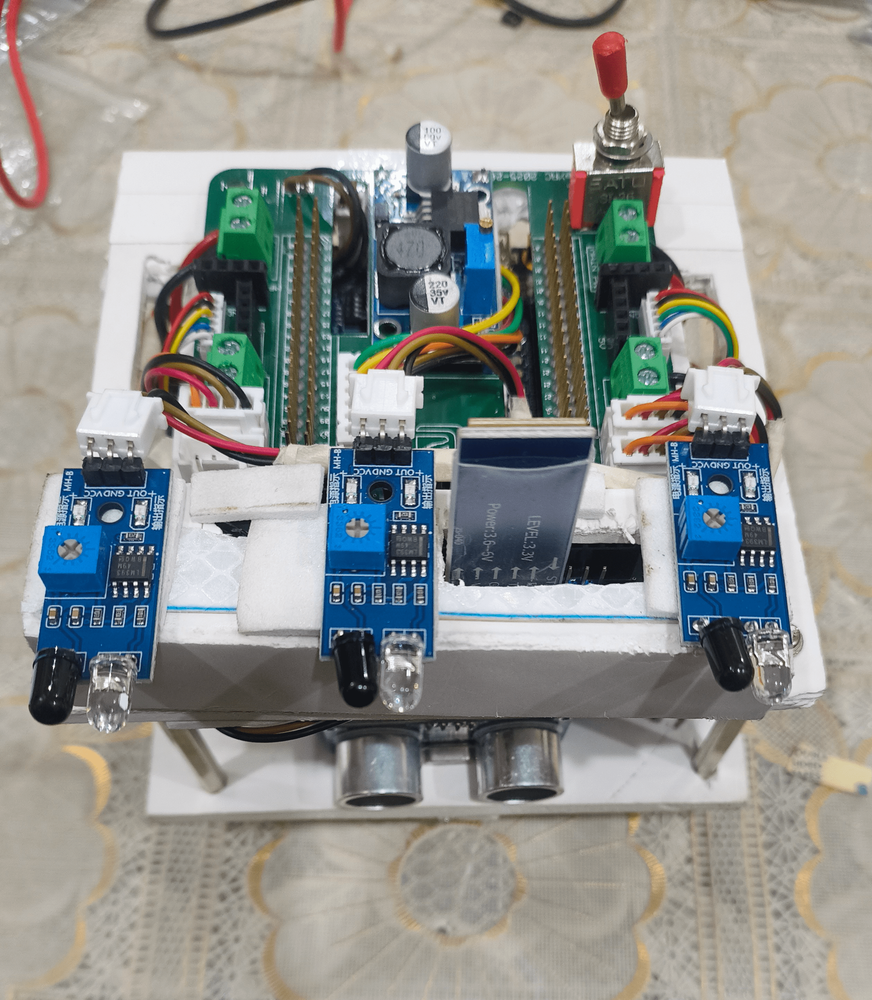

# MazeSolver Project Documentation

**Gallery**
 

**Project Overview**
- **Purpose:** FPGA-based autonomous maze solver implemented for the Intel Cyclone IV E DE0-Nano development board. The design integrates sensor interfaces, maze-solving logic, motor actuation, and communications to drive and monitor a small mobile robot or platform.
- **Target board:** Intel Cyclone IV E DE0-Nano (use USB-Blaster for programming and power board as needed).

**Repository Layout**
- **Top-level:** See [mazesolver.qpf](mazesolver.qpf) and [mazesolver.qsf](mazesolver.qsf) for Quartus project files and constraints. The project's generated programming file is available as `output_file.jic`.
- **Source code:** `code/` contains the Verilog modules and subfolders:
  - [code/mazesolver.v](code/mazesolver.v) — top-level entry for the design (integration point for modules).
  - [code/actuators/pwm_generator.v](code/actuators/pwm_generator.v) — PWM generator for motor control.
  - [code/common/frequency_scaling.v](code/common/frequency_scaling.v) — clock scaling / timer helpers.
  - [code/comms/ble.v](code/comms/ble.v) — Bluetooth Low Energy interface (host-facing logic).
  - [code/comms/rx.v](code/comms/rx.v) and [code/comms/tx.v](code/comms/tx.v) — UART/serial RX/TX building blocks used by communications.
  - [code/logic/actuation_logic.v](code/logic/actuation_logic.v) — high-level actuator command sequencing.
  - [code/logic/solver.v](code/logic/solver.v) — maze-solving algorithm implementation.
  - [code/logic/pid_centering.v](code/logic/pid_centering.v) — PID controller for line/center keeping.
  - [code/logic/pcb.v](code/logic/pcb.v) — glue logic / PCB-specific interfaces.
  - [code/sensors/top.v](code/sensors/top.v) — sensor aggregation/top sensor module.
  - [code/sensors/ir.v](code/sensors/ir.v) — IR sensor interface and thresholding.
  - [code/sensors/ultrasonic.v](code/sensors/ultrasonic.v) — ultrasonic distance sensor controller.
  - [code/sensors/encoder.v](code/sensors/encoder.v) — wheel encoder interface.
  - [code/sensors/dht.v](code/sensors/dht.v) — DHT sensor (temperature/humidity) interface if used.

**Module Responsibilities & Interfaces**
- `mazesolver.v`: top-level that instantiates clock/reset, sensor aggregator, solver, actuation, and comms. Acts as the integration point for on-board I/O and external connectors.
- `code/sensors/*`: collect raw sensor data, perform debouncing/timeout, and present a standardized sensor bus to the `solver` and `pid_centering` modules. Typical signals: sensor_valid, distance, ir_flags, encoder_counts.
- `code/logic/solver.v`: maze exploration/shortest-path logic. Inputs: sensor data and encoder feedback. Outputs: high-level motion commands (move forward, turn left/right, stop) and navigation state.
- `code/logic/pid_centering.v`: closed-loop controller to keep the vehicle centered or maintain heading using encoder and/or IR sensor feedback; exposes setpoint and command outputs to `actuation_logic`.
- `code/actuators/pwm_generator.v` and `code/logic/actuation_logic.v`: convert motion commands into PWM duty cycles and motor direction signals. Interfaces to motor drivers or H-bridge external to the FPGA.
- `code/comms/*`: provide telemetry and remote control via UART/BLE. These modules serialize status and accept high-level control commands.

**Hardware & Pin Mapping**
- Use [mazesolver.qsf](mazesolver.qsf) for the authoritative pin assignments that map logical I/Os to DE0-Nano pins (LEDs, switches, GPIO header, UART pins, motor driver signals, sensor pins, etc.).
- Typical external connections:
  - Power: 5V (via USB or external supply) and common ground between FPGA and peripherals.
  - Motor drivers: connect FPGA PWM and direction pins to an H-bridge module; ensure appropriate voltage/current handling and flyback diodes.
  - Sensors: IR and ultrasonic sensors to the GPIO header; encoders to digital inputs with optional hardware debouncing.
  - Communications: UART/TX/RX to BLE module or serial adapter as configured in `code/comms`.

**Simulation & Verification**
- Use ModelSim (or Quartus' integrated simulator) to simulate RTL modules. Create small testbenches for `solver.v`, `pid_centering.v`, `pwm_generator.v`, and sensors.
- The repository contains a `simulation/` folder (if present) — use or extend it with testbenches that drive typical sensor inputs and verify expected actuator outputs.
- For on-board runtime debugging, use SignalTap (Quartus Logic Analyzer) to capture internal signals such as `sensor_valid`, `encoder_counts`, `solver_state`, and PWM duty values.

**Testing Procedure (recommended)**
1. Power board with no motors connected; confirm basic boot and LEDs.
2. Verify communications: connect to UART or BLE interface and request telemetry; confirm sensor values are published.
3. Test sensors individually: IR thresholds, ultrasonic ping/echo timings, encoder pulse counting.
4. With motors connected to current-limited supply, run low-speed actuator tests using `actuation_logic` to confirm PWM and direction signals behave as expected.
5. Run full-stack maze navigation in a controlled environment; monitor telemetry and SignalTap captures.

**Troubleshooting Tips**
- No programming detected: verify USB-Blaster driver, cable, and that board is powered.
- Sensors reading incorrect values: check wiring, pull-ups/pull-downs, and signal conditioning (voltage levels).
- Motors jitter/saturate: verify PWM frequency in `pwm_generator.v` and apply proper motor driver filtering.
- Unexpected solver behavior: reproduce with simulation testbench and add SignalTap probes to `solver` outputs.

**Extending the Project**
- Add higher-level autonomy features (path smoothing).
- Integrate external logging via SD card or serial logging to capture run traces.
- Add calibration routines for sensors accessible via BLE commands.

**Key Files**
- Project file: [mazesolver.qpf](mazesolver.qpf)
- Constraints: [mazesolver.qsf](mazesolver.qsf)
- Top-level RTL: [code/mazesolver.v](code/mazesolver.v)
- Sensor aggregation: [code/sensors/top.v](code/sensors/top.v)
- Solver: [code/logic/solver.v](code/logic/solver.v)
- Actuation: [code/actuators/pwm_generator.v](code/actuators/pwm_generator.v)

---
